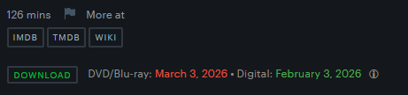

# Letterboxd DL Extension

A browser extension that enhances Letterboxd movie pages by adding:

* A **Download** button that **opens a list of trackers** to access or download the movie.
* **Digital & Blu-ray release dates**, displayed **to the right of the Download button** for quick reference.

## Installation

### Chrome / Chromium Browsers

1. Go to the **Releases** page of this repository  
2. Download the latest release and extract the `.zip` file
3. Open Chrome and go to: `chrome://extensions/`
4. Enable **Developer Mode** (top-right corner)
5. Click **Load unpacked** and select the extracted extension folder

### Firefox

1. Go to the **Releases** page of this repository
2. Download the latest `.xpi` file
3. Open Firefox and press **Ctrl + O**
4. Select the downloaded `.xpi` file
5. Confirm the installation when Firefox prompts you

## Usage

1. Open any **Letterboxd movie page**
2. Find the **Download button** near the TMDB, IMDB and WIKI button
3. Click it to fetch **download options**

## Screenshot

